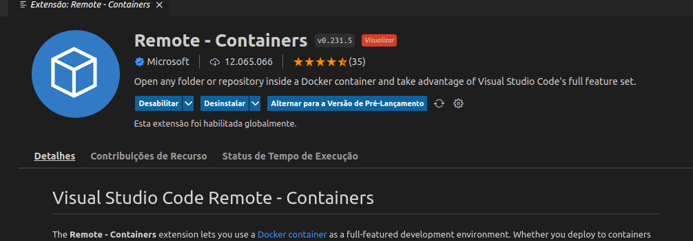
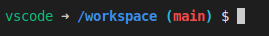

# **Go Scaffold**

## **O que é?** 

O Go scaffold é um template de projeto no qual já vem ferramentas básicas e avançadas para criações de API's.

## **Onde encontrar?**

https://github.com/facily-tech/go-scaffold

## **O que já vêm implementado nele?**

* Hot reload;
* Verificação de código com Go lint;
* Fácil utilização do Debug;
* Makefile para execução de comandos complexos de forma básica;
* Biblioteca para geração de mock's;
* Biblioteca para criação de documentação Swagger;
* Estrutura organizada.

## **Requisitos de instalação**

* Docker versão >= 20.10
* Docker-compose >= 1.29 ou Compátivel com versão de compose 3.8 ([Verificar documentação para mais informações](https://docs.docker.com/compose/))
* Plugin Remote-Container para VSCode

### **Como instalar dependencias?**

1.  [**Instalação Docker para Ubuntu**](https://docs.docker.com/engine/install/ubuntu/) ou 
[**Instalação Docker para distribuição Mint**](../Docker/docker.md).

Para verificar se a instalação ocorreu bem, execute: 

~~~docker
docker version
~~~

2. [**Instalação do docker-compose (compátivel com distribuição Mint)**](https://docs.docker.com/compose/install/)

- #### **NOTA:**
- Após instalação pode acontecer de comandos docker-compose receberem permissão negada, caso isso aconteça, execute: 

~~~bash 
 chmod +x docker-compose-linux-x86_64
~~~

- Para verificar se a instalação ocorreu bem, execute: 
~~~docker
docker-compose version
~~~
3. Instalação do Remote-Containers para criação de ambiente de desenvolvimento com Docker (Mais informações do plugin na documentação do [Remote-Container](https://code.visualstudio.com/docs/remote/containers))

## **Como utilizar?**
- Abra o VSCode
- Pressione Ctrl + Shift + P ou navegue até a palheta de comandos do VSCode e digite Remote-Containers
- Selecione a opção Open Folder in Container e selecione o workspace do Scaffold
- O Remote-Containers tratará de baixar as imagens necessárias e fazer as devidas configurações de acordo com o docker-compose do scaffold (Isso pode demorar um pouco).
- Após as devidas tratativas, a confirmação de que ocorreu tudo certo, será o terminal do VSCode da seguinte maneira: 

 
